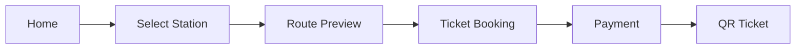

# 02 User Flow

## 🎯 Flow chính (Must-have)

Quy trình trải nghiệm người dùng cơ bản từ khi bắt đầu đến khi có vé:

## 🔥 Booking Flow chi tiết

Quy trình đặt vé chi tiết từng bước:

1. **[Home]**: Giao diện chính hiển thị các tính năng nhanh.
2. **[Select From/To]**: Người dùng chọn ga khởi hành và ga đến.
3. **[Show Route + Price]**: Hệ thống hiển thị lộ trình chi tiết và tính toán giá vé tự động.
4. **[Confirm]**: Người dùng xác nhận thông tin lộ trình và giá vé.
5. **[Payment]**: Thực hiện giao dịch thanh toán qua cổng điện tử.
6. **[Success + QR]**: Hiển thị thông báo thành công và cung cấp mã vé QR.

## ⚠️ Edge cases (Các trường hợp ngoại lệ)

Cần xử lý tốt các tình huống sau để đảm bảo trải nghiệm người dùng:

- **Không có tuyến**: Thông báo lỗi khi không tìm thấy lộ trình giữa hai ga đã chọn.
- **Thanh toán fail**: Xử lý khi giao dịch bị từ chối hoặc lỗi từ phía ngân hàng/ví điện tử.
- **Timeout API**: Cơ chế retry hoặc thông báo khi kết nối mạng không ổn định.
- **User chưa login**: Điều hướng người dùng đến trang đăng nhập/đăng ký khi thực hiện các tác vụ yêu cầu định danh (như thanh toán).
