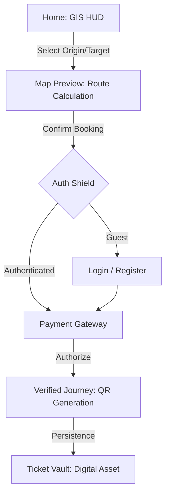

# 02 User Lifecycle & Behavioral Flows (Senior SPEC)

## 🎯 Primary Transactional Loop (GIS to Asset)

The MetroHCM experience is centered around the transition from a **Physical Search** (Map) to a **Digital Asset** (Ticket). 

---

## 🏗️ Detailed Step-by-Step Logic

### 1. GIS Discovery (Home / Map)
- **User Action**: Interactive selection of nodes on the SVG Map HUD.
- **System Logic**: Telemetry hooks (`useBooking`) calculate distance and dynamic pricing based on `fare.constants.ts`.
- **UI State**: The HUD updates in real-time, showing coordinates and route highlights.

### 2. Identity Gateway (Auth)
- **Barrier**: Protected routes (`/booking`, `/tickets`, `/profile`) trigger the **Edge Middleware**.
- **Redirection**: Unauthorized users are funneled into the minimalist `AuthLayout`.
- **Session Persistence**: Successful auth populates the `useAuthStore` and unlocks the **Dashboard**.

### 3. Payment & Asset Issuance
- **Interface**: The `PaymentGateway` module allows selection between **Metro Wallet**, **Card**, or **Banking**.
- **Wallet Logic**: If using `Metro Wallet`, the system verifies balance against the `UserService`.
- **Outcome**: A unique `TicketID` is generated, and its state is committed to the **Asset Ledger**.

### 4. Passenger Dashboard (The Vault)
- **Accessibility**: Users can access their active/expired tickets via the **Ticket Vault** (`/tickets`).
- **Profile Center**: The **Digital ID** (`/profile`) serves as the core passenger identity, aggregating transit history and wallet status.

---

## ⚠️ High-Fidelity Edge Cases

- **"Empty Vault" State**: Displayed when no transit data exists, with a CTA to return to the GIS Discovery.
- **Insufficient Wallet Balance**: Triggered during the Payment step, prompting an immediate "Wallet Refill" flow.
- **Session Expiry**: Handled by the Middleware, ensuring the user is returned to the "Secure Gateway" if the token is void.
- **Map Desync**: Standardized error HUD if the SVG node IDs don't match the internal coordinate constants.

---

## 🔐 Route Access Control (RBAC)

| Route | Minimum Logic | UI Feedback |
| :--- | :--- | :--- |
| `/` | Public | Full GIS HUD |
| `/tickets` | Authenticated | Private Asset Grid |
| `/profile` | Authenticated | Personal Identity HUD |
| `/booking/*` | Authenticated | Transactional Portal |
