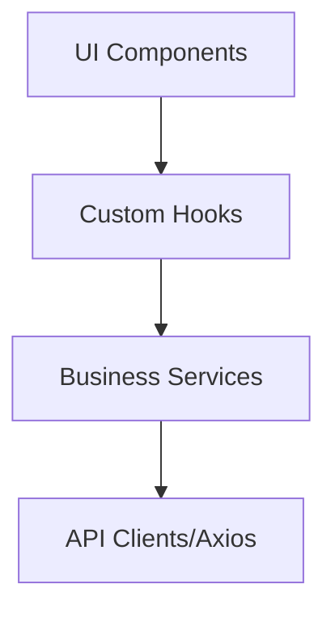

# 04 Frontend Architecture

## 🧠 Pattern

Chúng ta áp dụng các mẫu thiết kế hiện đại để đảm bảo khả năng mở rộng và bảo trì dễ dàng:

- **Feature-based Structure**: Chia dự án theo các tính năng (features) thay vì theo loại tệp tin. Mỗi tính năng là một module độc lập chứa đầy đủ logic của nó.
- **Clean Architecture**: Phân tách logic nghiệp vụ (business logic) khỏi framework và giao diện người dùng, giúp dễ dàng kiểm thử và thay đổi công nghệ nếu cần.
- **Separation of Concerns (SoC)**: Mọi tệp tin đều chỉ chịu trách nhiệm cho một công việc duy nhất (UI chỉ lo hiển thị, Service chỉ lo dữ liệu, API chỉ lo truyền tải).

## 📦 Layers (Phân lớp)

Luồng dữ liệu trong ứng dụng tuân thủ mô hình phân lớp một chiều:



- **UI**: Thành phần giao diện (React/Vue components) - chịu trách nhiệm hiển thị dữ liệu và nhận sự kiện từ người dùng.
- **Hooks**: Quản lý trạng thái và kết nối UI với logic - chứa các logic xử lý trạng thái (state management) và side effects.
- **Services**: Xử lý logic nghiệp vụ - tính toán, chuyển đổi định dạng dữ liệu trước khi trả về hoặc gửi đi.
- **API**: Lớp giao tiếp với Backend - thực hiện các yêu cầu HTTP (Get, Post, Put, Delete).

## 📁 Folder Detail (Cấu trúc thư mục)

Ví dụ chi tiết cho tính năng đặt vé (`ticket`):

```text
src/features/ticket/
├── components/     # Các UI Components dành riêng cho tính năng Ticket (Atoms, Molecules, Organisms)
├── hooks/          # Custom hooks xử lý logic đặt vé, quản lý state cho form
├── services/       # Logic xử lý dữ liệu: tính giá vé, map lộ trình ga
├── types/          # Định nghĩa TypeScript interface/types cho Ticket
└── index.ts        # Entry point để export các thành phần ra ngoài
```
