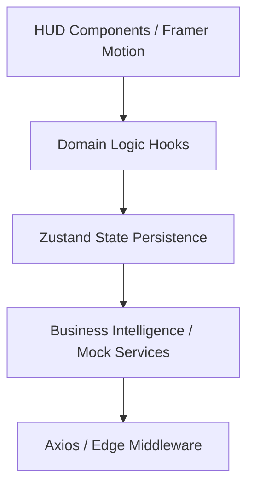

# 04 Frontend Architecture (Senior BigTech Spec)

## 🏢 Architectural Blueprint

MetroHCM adopts a **Feature-Driven Modular Architecture** designed for extreme scalability and separation of concerns. This project follows the "Command Center" paradigm, where the UI is treated as a high-fidelity Digital Twin of the physical metro infrastructure.

### 📐 Feature-Sliced Core
The project is decoupled into autonomous features located in `src/features/`. Each feature is a self-contained domain:
- **Auth**: Identity Gateway & Session Management.
- **Booking**: GIS Map Engine & Transactional Flow.
- **Tickets**: Asset Ledger & Digital Vault.
- **User**: Profile Intelligence & Metro Wallet.

---

## 📦 System Layers

The data flow follows a strict unidirectional lifecycle to maintain 60fps HUD performance:



### 1. View Layer (The HUD)
- **Technology**: React 18 / Next.js 15 (App Router).
- **Styling**: Vanilla Tailwind CSS + Glassmorphism Primitives.
- **Animation**: Framer Motion for high-frequency telemetry updates.

### 2. State Layer (Atomic Store)
- **Foundation**: Zustand.
- **Persistence**: Hybrid approach (Local Storage for Auth/Booking).
- **Slices**: Decentralized stores per feature (e.g., `useAuthStore`, `useBookingStore`).

### 3. Logic Layer (Hooks & Services)
- **Hooks**: Abstract complex UI states (e.g., `useMapTelemetry`).
- **Services**: Pure business logic (e.g., `fare.service.ts` for distance-based pricing).

---

## 🧭 Directory Taxonomy

Every feature follows a standardized internal hierarchy for predictability:

```text
src/features/[domain]/
├── components/     # Atomic HUD elements (Base -> Composite)
├── hooks/          # Telemetry & UI-State logic
├── services/       # Domain logic & Mock API integration
├── constants/      # Static GIS data & Business rules
└── index.ts        # Public API for other features
```

---

## 🛡️ Security & Route Protection

We utilize **Next.js Edge Middleware** for enterprise-grade access control:
- **Protected Routes**: `/tickets`, `/profile`, `/booking`.
- **Logic**: JWT/Session verification at the edge to prevent waterfall redirects.
- **Persistence**: Secure cookie-based session handling via `useAuthStore`.

---

## 🗺️ Digital Twin Logic (GIS HUD)

The `MapPreview` component is the system's core engine, utilizing:
- **SVG Geodata**: Static coordinates for 14+ stations.
- **Telemetry Hooks**: `useFleet` calculates real-time train positions using localized mock algorithms.
- **Interaction**: Path-finding algorithms to calculate route fees (`fare.constants.ts`).
